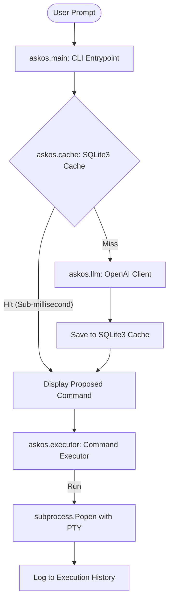

# System Architecture

This document outlines the internal architecture of **Ask-OS**.

## Component Diagram

The interaction between different modules in the CLI is described in the diagram below:

## Modules

### 1. Command Router (`askos.main`)
Uses the `typer` framework to configure options and command line entry points. It manages configuration setup, cache status/cleanup, history display, and coordinates the primary prompt translation flow.

### 2. Environment Scanner (`askos.utils`)
Before querying the LLM, the system scans the local environment for:
* Operating System
* Active shell (Bash, Zsh, PowerShell, etc.)
* Privilege levels (Root/Sudo vs Standard)
* Locally available CLI packages and package managers (e.g. `apt-get`, `brew`, `pip`, `npm`)

This information is injected into the LLM system prompt to ensure that generated commands are perfectly tailored to the environment.

### 3. LLM Wrapper (`askos.llm`)
Wraps the `openai` API client. It has three roles:
* **`generate_command`**: Translates natural language to terminal command.
* **`generate_correction`**: Translates error logs from failed commands into corrected alternatives.
* **`explain_command`**: Explains command parts step-by-step.

### 4. Interactive Pseudo-Terminal Executor (`askos.executor`)
Instead of standard pipe streams which block or buffer output:
* Uses a Unix Pseudo-Terminal (`pty`) to run commands in an interactive TTY.
* Uses non-blocking `select` loops to stream daemon log outputs (like Django `runserver`) in real-time.
* Forwards standard input (`stdin`) to support passwords and confirmation screens interactively.
* Automatically falls back to standard pipelines on non-Unix environments like Windows.
